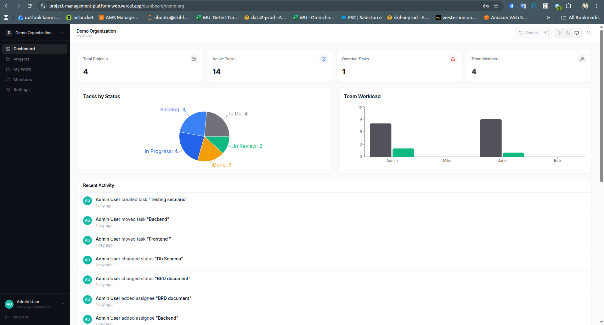
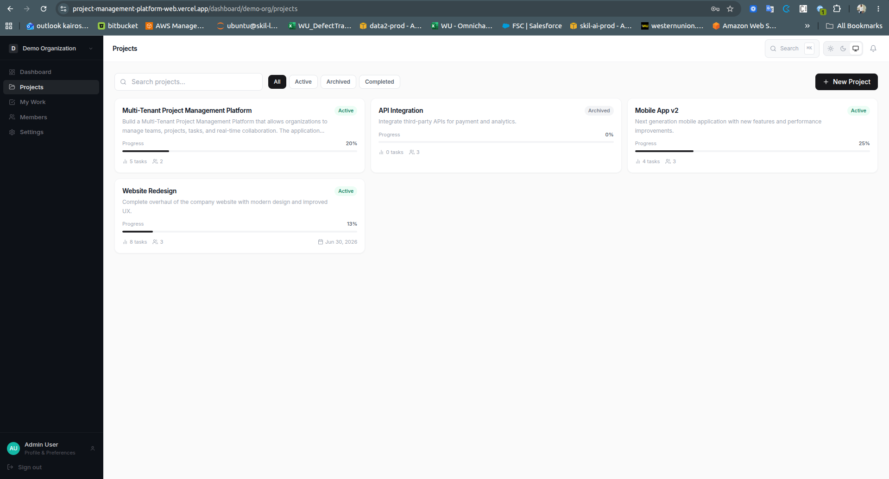
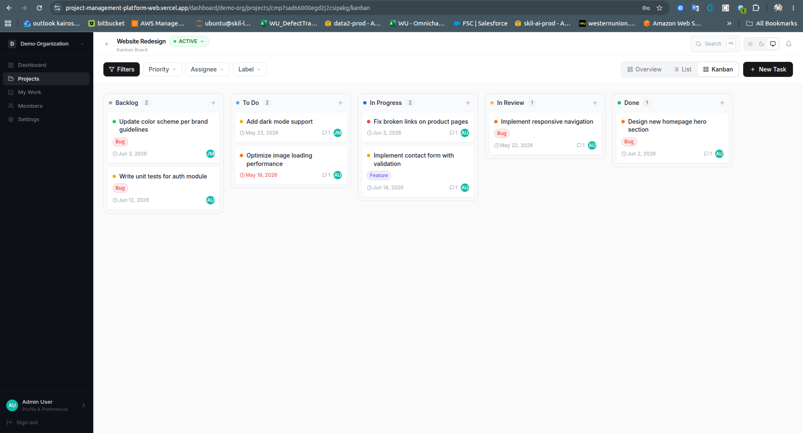
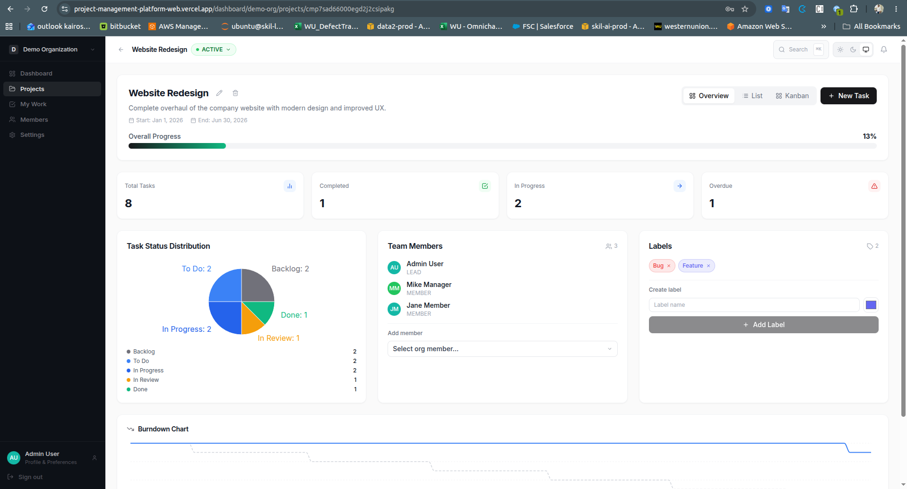
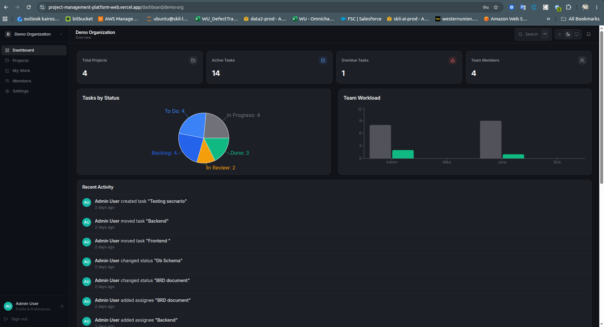
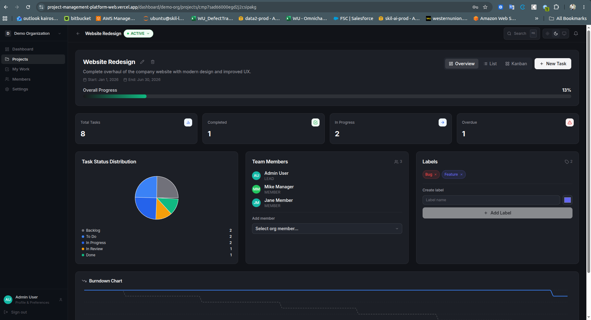

# ProjectFlow

A production-grade, multi-tenant SaaS project management platform — built with Next.js 14, Node.js/Express, MongoDB, Redis, and Socket.IO.

> **Demo:** `admin@demo.com` / `manager@demo.com` / `member@demo.com` / `viewer@demo.com` — all use `password123`

---

## Live Deployment

| Service | Platform | URL |
|---------|----------|-----|
| **Frontend** (Next.js 14) | Vercel | https://project-management-platform-web.vercel.app |
| **Backend API** (Node.js / Express) | Render | https://projectflow-api-wijm.onrender.com |
| **API Docs** (Swagger UI) | Render | https://projectflow-api-wijm.onrender.com/api/docs |
| **Database** (MongoDB) | MongoDB Atlas (M0 free cluster) | — |
| **Cache / Queue** (Redis) | [Upstash](https://upstash.com) (free tier) | — |

> All services run on free tiers. Render sleeps after 15 min of inactivity — first request after sleep takes ~30s.

---

## Screenshots

| Dashboard | Projects |
|-----------|----------|
|  |  |

| Kanban Board | Project Detail |
|--------------|----------------|
|  |  |

**Dark Mode**

| Dashboard (Dark) | Project Detail (Dark) |
|------------------|-----------------------|
|  |  |

---

## Features

### Core
- **Multi-tenancy** — each organization is fully isolated; all queries are scoped to `organizationId`
- **Role-based access control** — `OWNER > ADMIN > MANAGER > MEMBER > VIEWER` hierarchy enforced on both the API and frontend. Role guards hide destructive actions from users who lack permission rather than letting the API silently return 403.
- **Organizations** — create new organizations from the sidebar switcher; rename (ADMIN+); delete with type-to-confirm prompt (OWNER only); switch between multiple orgs with instant navigation
- **Projects** — create, update (MEMBER+), delete with type-to-confirm prompt (MANAGER+); progress tracking; per-project member management
- **Tasks** — full lifecycle (`BACKLOG → TODO → IN_PROGRESS → IN_REVIEW → DONE`), priority levels, due dates, assignees, labels, subtasks, comments, file attachments, and activity log
- **Kanban board** — drag-and-drop columns powered by `@dnd-kit`; real-time sync across all connected users
- **Task list view** — filterable, sortable table with inline editing
- **My Work** — cross-project view of all tasks assigned to the current user, grouped by due-date urgency
- **Full-text search** — search tasks, projects, and comments across the organization
- **Notifications** — real-time bell with unread count; mark individual or all-read
- **Member invitations** — token-based email invites with role assignment
- **Team members page** — manage roles and remove members

---

## Tech Stack

### Backend (`apps/api`)
| Concern | Library |
|---------|---------|
| HTTP server | Express + express-async-errors |
| ORM | Prisma + MongoDB |
| Cache / rate limit | ioredis (Redis) |
| Real-time | Socket.IO |
| Auth | JWT (access 15m + refresh 7d, HTTP-only cookie) |
| Validation | Zod |
| Password hashing | bcryptjs |
| API docs | swagger-ui-express |
| Security | helmet, cors, express-rate-limit |

### Frontend (`apps/web`)
| Concern | Library |
|---------|---------|
| Framework | Next.js 14 (App Router) |
| Server state | TanStack Query v5 |
| Client state | Zustand (persisted) |
| Forms | React Hook Form + Zod |
| Styling | Tailwind CSS |
| Real-time | Socket.IO client |
| Drag & Drop | @dnd-kit |
| Charts | Recharts |
| Icons | Lucide React |

---

## Quick Start

### Prerequisites
- Node.js 18+
- Docker (MongoDB)
- Redis on `localhost:6379`

### 1. Start infrastructure

**First time only:**
```bash
# Start MongoDB with replica set (required by Prisma for transactions)
docker run -d --name project-mongo -p 27018:27017 mongo:7 --replSet rs0

# Initialize the replica set
docker exec project-mongo mongosh --eval \
  'rs.initiate({_id:"rs0",members:[{_id:0,host:"127.0.0.1:27017"}]})'
```

**Subsequent starts:**
```bash
docker start project-mongo
```

### 2. Backend

```bash
cd apps/api
npm install
npm run db:push   # push Prisma schema → DB
npm run db:seed   # seed demo data
npm run dev
# API:   http://localhost:3001
# Docs:  http://localhost:3001/api/docs
```

### 3. Frontend

```bash
cd apps/web
npm install
npm run dev
# App:   http://localhost:3000
```

### Demo credentials

| Email | Password | Role |
|-------|----------|------|
| admin@demo.com | password123 | OWNER |
| manager@demo.com | password123 | MANAGER |
| member@demo.com | password123 | MEMBER |
| viewer@demo.com | password123 | VIEWER |

---

## Architecture

### Backend — Clean Architecture

```
Controllers → Services → Repositories → Prisma (MongoDB)
```

| Layer | Responsibility |
|-------|----------------|
| **Controllers** | Parse `req`, call one service method, call `successResponse()` |
| **Services** | Business logic, validation, Socket.IO events, notifications, audit logs |
| **Repositories** | Prisma queries only — no `if` statements beyond `where` clauses |
| **Middleware** | `auth`, `orgAccess`, `validate`, `rateLimiter`, `error` |

Errors are thrown as `AppError` and caught by the central `errorMiddleware` — no try/catch in routes or controllers.

### Frontend — State Split

| State type | Tool |
|-----------|------|
| Server data (tasks, projects, members) | TanStack Query — `useQuery` / `useMutation` + `invalidateQueries` |
| Auth session | Zustand `auth-storage` (persisted) |
| Current org | Zustand `org-storage` (persisted) |
| Theme preference | Zustand `theme-storage` (persisted) |
| Notification bell | Zustand in-memory (not persisted) |

---

## Database Schema

> Full ERD and schema documentation: **[SCHEMA.md](./SCHEMA.md)**

```
User ──< OrganizationMember >── Organization
Organization ──< Project ──< Task
Task ──< TaskComment
Task ──< TaskAssignee >── User
Task ──< TaskLabel >── Label
Task ──< Subtask
Task ──< TaskActivity
Task ──< TaskAttachment
User ──< Notification
Organization ──< AuditLog
Organization ──< Webhook ──< WebhookDelivery
```

**Role hierarchy:** `OWNER > ADMIN > MANAGER > MEMBER > VIEWER`

**Task status flow:** `BACKLOG → TODO → IN_PROGRESS → IN_REVIEW → DONE`

All user-facing entities use **soft deletes** (`deletedAt`). `prisma.*.delete()` is never called directly.

---

## API Reference

Full interactive docs at **https://projectflow-api-wijm.onrender.com/api/docs** (or `http://localhost:3001/api/docs` locally)

### Auth
| Method | Path | Description |
|--------|------|-------------|
| POST | `/api/v1/auth/register` | Register + create org |
| POST | `/api/v1/auth/login` | Login |
| POST | `/api/v1/auth/refresh` | Refresh access token |
| POST | `/api/v1/auth/logout` | Logout |
| POST | `/api/v1/auth/forgot-password` | Send reset email |
| POST | `/api/v1/auth/reset-password` | Reset with token |
| GET | `/api/v1/auth/me` | Get current user |
| PATCH | `/api/v1/auth/profile` | Update name, avatar, timezone, notification prefs |
| PATCH | `/api/v1/auth/profile/password` | Change password |

### Organizations
| Method | Path | Min Role | Description |
|--------|------|----------|-------------|
| GET | `/api/v1/organizations` | — | List user's orgs |
| POST | `/api/v1/organizations` | — | Create org (any authenticated user) |
| GET | `/api/v1/organizations/:orgId` | VIEWER | Get org details |
| PATCH | `/api/v1/organizations/:orgId` | ADMIN | Rename org |
| DELETE | `/api/v1/organizations/:orgId` | OWNER | Delete org (cascades all data) |
| GET | `/api/v1/organizations/:orgId/members` | VIEWER | List members |
| POST | `/api/v1/organizations/:orgId/invites` | ADMIN | Invite member with role |
| POST | `/api/v1/organizations/invites/:token/accept` | — | Accept email invite |
| PATCH | `/api/v1/organizations/:orgId/members/:userId/role` | ADMIN | Update member role |
| DELETE | `/api/v1/organizations/:orgId/members/:userId` | ADMIN | Remove member |
| GET | `/api/v1/organizations/:orgId/audit-log` | ADMIN | Paginated audit log |

### Projects
| Method | Path | Min Role | Description |
|--------|------|----------|-------------|
| GET | `/api/v1/organizations/:orgId/projects` | VIEWER | List projects |
| POST | `/api/v1/organizations/:orgId/projects` | MEMBER | Create project |
| GET | `/api/v1/organizations/:orgId/projects/:projectId` | VIEWER | Get project + stats |
| PATCH | `/api/v1/organizations/:orgId/projects/:projectId` | MEMBER | Update project |
| DELETE | `/api/v1/organizations/:orgId/projects/:projectId` | MANAGER | Soft delete project |
| GET | `/api/v1/organizations/:orgId/projects/:projectId/stats` | VIEWER | Stats + burndown data |
| GET/POST/DELETE | `.../labels` | MEMBER | Manage labels |
| GET/POST/DELETE | `.../members` | MANAGER | Manage project members |

### Tasks

> Base: `/api/v1/organizations/:orgId/projects/:projectId/tasks`

| Method | Path | Description |
|--------|------|-------------|
| GET | `.../tasks` | List (filter by status, priority, assignee) |
| GET | `.../tasks/kanban` | Grouped by status for kanban view |
| GET | `.../tasks/export` | Download as CSV |
| POST | `.../tasks` | Create task |
| POST | `.../tasks/bulk` | Bulk move / delete |
| GET | `.../tasks/:taskId` | Task detail |
| PATCH | `.../tasks/:taskId` | Update task |
| DELETE | `.../tasks/:taskId` | Soft delete |
| PATCH | `.../tasks/:taskId/move` | Move (status + position) |
| POST/DELETE | `.../tasks/:taskId/assignees` | Add / remove assignee |
| POST/DELETE | `.../tasks/:taskId/labels` | Add / remove label |
| GET/POST/DELETE | `.../tasks/:taskId/comments` | Comments (supports @mentions) |
| GET/POST/DELETE | `.../tasks/:taskId/attachments` | File attachments |
| GET/POST/PATCH/DELETE | `.../tasks/:taskId/subtasks` | Subtasks |
| GET | `.../tasks/:taskId/activities` | Activity log |

### Webhooks

> Base: `/api/v1/organizations/:orgId/webhooks`

| Method | Path | Description |
|--------|------|-------------|
| GET | `.../webhooks` | List webhooks |
| GET | `.../webhooks/events` | All supported event types |
| POST | `.../webhooks` | Create (returns secret once) |
| PATCH | `.../webhooks/:id` | Update (name, url, events, active) |
| DELETE | `.../webhooks/:id` | Delete |
| POST | `.../webhooks/:id/rotate-secret` | Rotate HMAC signing secret |
| GET | `.../webhooks/:id/deliveries` | Delivery log |

### Other
| Method | Path | Description |
|--------|------|-------------|
| GET | `/api/v1/my-tasks` | Tasks assigned to current user (cross-project) |
| GET | `/api/v1/notifications` | List notifications |
| PATCH | `/api/v1/notifications/:id/read` | Mark read |
| POST | `/api/v1/notifications/read-all` | Mark all read |
| GET | `/api/v1/notifications/count` | Unread count |
| GET | `/api/v1/search?q=&orgId=&type=` | Full-text search (tasks, projects, comments) |
| GET | `/api/v1/dashboard/:orgId` | Dashboard stats + chart data |

---

## Real-Time Events (Socket.IO)

### Server → Client
| Event | Payload | Trigger |
|-------|---------|---------|
| `task:created` | Task | Task created |
| `task:updated` | Task | Any task field changed |
| `task:moved` | `{taskId, status, position}` | Drag-drop reorder |
| `task:deleted` | `{taskId, projectId}` | Task deleted |
| `tasks:bulk-updated` | `{projectId, taskIds}` | Bulk status / delete |
| `comment:created` | Comment | New comment posted |
| `notification:new` | Notification | New notification |
| `user:online` | `{userId}` | User connects |
| `user:offline` | `{userId}` | User disconnects |
| `typing:start` / `typing:stop` | `{userId, taskId}` | Typing indicator |

### Client → Server
| Event | Payload |
|-------|---------|
| `join:project` | `projectId` |
| `leave:project` | `projectId` |
| `join:task` | `taskId` |
| `typing:start` / `typing:stop` | `{taskId}` |

---

## Webhook System

### Supported Events

| Event | Fires when |
|-------|-----------|
| `project.created` | A new project is created |
| `project.updated` | Project name, description, or status changes |
| `project.deleted` | A project is soft-deleted |
| `task.created` | A new task is created |
| `task.updated` | Any task field changes |
| `task.deleted` | A task is soft-deleted |
| `task.moved` | A task is moved between columns or reordered |
| `comment.created` | A comment is posted on a task |
| `member.added` | A member joins the organization (invite accepted) |
| `member.removed` | A member is removed from the organization |
| `member.role_changed` | A member's role is updated |

### Request Format

```
POST https://your-endpoint.com/hook
Content-Type: application/json
X-ProjectFlow-Event: task.created
X-ProjectFlow-Delivery: <uuid>
X-ProjectFlow-Signature: sha256=<hmac-hex>
```

### Verifying Signatures

```typescript
import { createHmac, timingSafeEqual } from 'crypto'

function verify(rawBody: string, signature: string, secret: string): boolean {
  const expected = 'sha256=' + createHmac('sha256', secret).update(rawBody).digest('hex')
  return expected.length === signature.length &&
    timingSafeEqual(Buffer.from(expected), Buffer.from(signature))
}
```

Deliveries that fail (non-2xx or timeout after 10s) are logged but not retried — inspect them in **Settings → Webhooks → Delivery Log**.

---

## Security

- JWT access tokens (15 min) + refresh tokens (7 days, HTTP-only cookie)
- Rate limiting: 100 req / 15 min general · 10 req / 15 min for auth endpoints
- Helmet security headers
- CORS restricted to frontend origin
- All queries scoped to `organizationId` — no cross-tenant data leakage
- Input validation with Zod on every endpoint
- Soft deletes — data is never permanently removed via the API
- Webhook signatures use HMAC-SHA256 with timing-safe comparison

---

## Environment Variables

```env
# apps/api/.env
DATABASE_URL="mongodb://127.0.0.1:27018/project_mgmt?directConnection=true&replicaSet=rs0"
REDIS_URL="redis://localhost:6379"
JWT_SECRET="min-32-chars-secret"
JWT_REFRESH_SECRET="min-32-chars-secret"
JWT_EXPIRES_IN="15m"
JWT_REFRESH_EXPIRES_IN="7d"
PORT=3001
NODE_ENV="development"
FRONTEND_URL="http://localhost:3000"
UPLOAD_DIR="uploads"
MAX_FILE_SIZE=10485760

# Email — omit in dev; emails print to console instead
SMTP_HOST="smtp.example.com"
SMTP_PORT=587
SMTP_USER="noreply@example.com"
SMTP_PASS="your-smtp-password"
SMTP_FROM="ProjectFlow <noreply@example.com>"
```

> **Frontend:** Set `NEXT_PUBLIC_API_URL` to the full API base path (e.g. `https://projectflow-api.onrender.com/api/v1`). Falls back to `http://localhost:3001/api/v1` in development. The Socket.IO URL is derived automatically by stripping `/api/v1`.

---

## Deployment

### Stack (fully free tier)

```
Vercel        → Next.js frontend
Render        → Node.js API
MongoDB Atlas → Database (M0 free cluster)
Upstash       → Redis (email queue)
```

| Platform | Hosts | Free Tier |
|----------|-------|-----------|
| [Vercel](https://vercel.com) | Next.js frontend | Free forever |
| [Render](https://render.com) | Node.js API | Free (sleeps after 15 min inactivity) |
| [MongoDB Atlas](https://mongodb.com/atlas) | Database | Free (M0 — 512 MB) |
| [Upstash](https://upstash.com) | Redis | Free (10k req/day) |

---

### Step 1 — MongoDB Atlas

1. Create a free account at [mongodb.com/atlas](https://mongodb.com/atlas)
2. Create a **free M0 cluster** (any region)
3. Add a database user: **Database Access → Add New User**
4. Allow all IPs: **Network Access → Add IP Address → Allow Access from Anywhere** (`0.0.0.0/0`)
5. Get connection string: **Connect → Drivers** → copy the URI
   ```
   mongodb+srv://<user>:<password>@<cluster>.mongodb.net/project_mgmt?retryWrites=true&w=majority
   ```

### Step 2 — Upstash Redis

1. Create a free account at [upstash.com](https://upstash.com)
2. Create a **Redis database** (any region, free tier)
3. Copy the **REST URL** — use the `rediss://` connection string shown in the dashboard

### Step 3 — Render (Backend API)

1. Create account at [render.com](https://render.com)
2. **New → Web Service** → connect your GitHub repo
3. Set:
   - **Root Directory**: `apps/api`
   - **Build Command**: `npm install && npx prisma generate && npm run build`
   - **Start Command**: `node dist/index.js`
4. Add environment variables (from `.env.example`):
   | Key | Value |
   |-----|-------|
   | `DATABASE_URL` | MongoDB Atlas connection string |
   | `REDIS_URL` | Upstash Redis connection string |
   | `JWT_SECRET` | Random 32+ char string |
   | `JWT_REFRESH_SECRET` | Random 32+ char string |
   | `FRONTEND_URL` | Your Vercel URL (add after step 4) |
   | `NODE_ENV` | `production` |
5. Deploy → copy your Render API URL (e.g. `https://projectflow-api.onrender.com`)
6. Seed demo data via Render Shell:
   ```bash
   npx ts-node -r tsconfig-paths/register prisma/seed.ts
   ```

### Step 4 — Vercel (Frontend)

1. Create account at [vercel.com](https://vercel.com)
2. **New Project** → Import your GitHub repo
3. Set **Root Directory** to `apps/web`
4. Add environment variable:
   | Key | Value |
   |-----|-------|
   | `NEXT_PUBLIC_API_URL` | `https://projectflow-api.onrender.com/api/v1` |
5. Deploy — Vercel auto-detects Next.js

> **Note:** Render free tier sleeps after 15 min of inactivity. First request after sleep takes ~30s. Upgrade to a paid plan to keep it always-on.

---

## Bonus Features

### 1. Dark Mode

System-aware dark/light/system preference persisted via Zustand + localStorage. The `dark` class is toggled on `document.documentElement` by a `ThemeProvider` component. When preference is `system`, a `matchMedia` change listener updates the theme in real time without a page reload.

Premium surface hierarchy matching Linear/Vercel quality:

| Token | Hex | Use |
|-------|-----|-----|
| `surface-nav` | `#0D1117` | Sidebar background |
| `surface-bg` | `#111318` | Page background |
| `surface-card` | `#1C1F26` | Cards, table rows |
| `surface-elevated` | `#22262F` | Modals, dropdowns, inputs |

Toggle lives in the Sidebar, cycling `Sun → Moon → Monitor` icons.

---

### 2. Audit Trail

Every significant org-level mutation is recorded in an `AuditLog` collection. Viewable in **Settings → Audit Log** (ADMIN+ only), paginated and sorted by time.

| Event logged | Trigger |
|---|---|
| `project.created` | Project created |
| `project.updated` | Project name/status changed |
| `project.deleted` | Project soft-deleted |
| `member.role_changed` | Member role updated |
| `member.removed` | Member removed from org |

---

### 3. Webhook System

Outbound HTTP webhooks with HMAC-SHA256 request signing. Managed in **Settings → Webhooks**.

**11 supported events:** `task.created`, `task.updated`, `task.deleted`, `task.moved`, `comment.created`, `project.created`, `project.updated`, `project.deleted`, `member.added`, `member.removed`, `member.role_changed`

Features:
- Secret in `whsec_<48 hex>` format, shown only at creation time
- Secret rotation via one-click button
- Per-webhook pause/enable toggle
- Delivery log showing status code, success/failure, and error per attempt
- 10s timeout per delivery, fire-and-forget (never blocks the API response)

Signature verification:
```typescript
import { createHmac, timingSafeEqual } from 'crypto'

function verify(rawBody: string, signature: string, secret: string): boolean {
  const expected = 'sha256=' + createHmac('sha256', secret).update(rawBody).digest('hex')
  return timingSafeEqual(Buffer.from(expected), Buffer.from(signature))
}
```

---

### 4. Performance Optimizations

| Optimization | Detail |
|---|---|
| **Dynamic imports** | `DashboardCharts` (Recharts) and `TaskDetailModal` are dynamically imported — not in the initial bundle |
| **TanStack Query tuning** | `staleTime: 30s`, `gcTime: 5min`, `retry: 1`, `refetchOnWindowFocus: false` |
| **App Router streaming skeletons** | 5 `loading.tsx` files with `animate-pulse` skeletons — content streams per segment, no full-page loading flash |
| **Database indexes** | 12 compound indexes in `schema.prisma` covering kanban, list, my-tasks, audit log, and webhook trigger queries |
| **Optimistic updates** | Kanban drag-and-drop uses `qc.setQueryData()` for instant UI response; reverts on error |

---

### 5. Accessibility (WCAG 2.1 AA)

| Area | Implementation |
|---|---|
| **Focus trap** | `Modal.tsx` traps Tab/Shift+Tab, restores focus on close |
| **Skip navigation** | `<a href="#main-content">` visible on focus in dashboard layout |
| **SelectDropdown ARIA** | `role="combobox"`, `aria-haspopup="listbox"`, `role="option"`, `aria-selected`, `aria-activedescendant`, full keyboard nav (`↑↓ Enter Escape Home End`) |
| **Keyboard DnD** | `@dnd-kit` `KeyboardSensor` — Space to grab, arrows to move, Space/Enter to drop |
| **Icon-only buttons** | `aria-label` on every icon button, `aria-hidden` on SVG icons |
| **Screen reader priority** | Colored priority dot + `<span className="sr-only">{priority} priority</span>` |
| **Semantic HTML** | `<nav aria-label>`, `<th scope="col">`, `<ol>` for activity feeds, `<main id="main-content">` |
| **Form errors** | `aria-invalid` + `aria-describedby` linking inputs to `role="alert"` error messages |
