# Database Schema — ProjectFlow

> **Live deployment:** Database hosted on **MongoDB Atlas** (M0 free cluster). Schema is managed via Prisma — `prisma/schema.prisma` is the single source of truth.

## Entity Relationship Diagram

```mermaid
erDiagram
    User {
        string id PK
        string email UK
        string name
        string password
        string avatarUrl
        string timezone
        json notificationPrefs
        datetime createdAt
        datetime updatedAt
        datetime deletedAt
    }

    Organization {
        string id PK
        string name
        string slug UK
        string logoUrl
        json billingInfo
        datetime createdAt
        datetime updatedAt
        datetime deletedAt
    }

    OrganizationMember {
        string id PK
        string organizationId FK
        string userId FK
        enum role
        datetime joinedAt
    }

    OrganizationInvite {
        string id PK
        string organizationId FK
        string email
        enum role
        string token UK
        string invitedById
        datetime expiresAt
        datetime acceptedAt
        datetime createdAt
    }

    Project {
        string id PK
        string organizationId FK
        string name
        string description
        enum status
        enum visibility
        datetime startDate
        datetime endDate
        string leadId
        datetime createdAt
        datetime updatedAt
        datetime deletedAt
    }

    ProjectMember {
        string id PK
        string projectId FK
        string userId FK
        enum role
        datetime joinedAt
    }

    Label {
        string id PK
        string projectId FK
        string name
        string color
        datetime createdAt
    }

    Task {
        string id PK
        string projectId FK
        string title
        string description
        enum status
        enum priority
        datetime dueDate
        int storyPoints
        float position
        datetime createdAt
        datetime updatedAt
        datetime deletedAt
    }

    Subtask {
        string id PK
        string taskId FK
        string title
        boolean completed
        int position
        datetime createdAt
    }

    TaskAssignee {
        string id PK
        string taskId FK
        string userId FK
        datetime assignedAt
    }

    TaskLabel {
        string taskId FK
        string labelId FK
    }

    TaskComment {
        string id PK
        string taskId FK
        string userId FK
        string content
        string[] mentions
        datetime createdAt
        datetime updatedAt
        datetime deletedAt
    }

    TaskAttachment {
        string id PK
        string taskId FK
        string name
        string url
        int size
        string mimeType
        string uploadedById FK
        datetime createdAt
    }

    TaskActivity {
        string id PK
        string taskId FK
        string userId FK
        string action
        string oldValue
        string newValue
        datetime createdAt
    }

    TaskDependency {
        string blockingTaskId FK
        string blockedByTaskId FK
    }

    Notification {
        string id PK
        string userId FK
        string organizationId FK
        string type
        string title
        string message
        json data
        boolean read
        datetime createdAt
    }

    AuditLog {
        string id PK
        string organizationId FK
        string userId FK
        string action
        string entityType
        string entityId
        json metadata
        datetime createdAt
    }

    Webhook {
        string id PK
        string organizationId FK
        string name
        string url
        string secret
        string[] events
        boolean active
        datetime createdAt
        datetime updatedAt
    }

    WebhookDelivery {
        string id PK
        string webhookId FK
        string event
        json payload
        int statusCode
        boolean success
        string error
        datetime createdAt
    }

    RefreshToken {
        string id PK
        string token UK
        string userId FK
        datetime expiresAt
        datetime createdAt
    }

    PasswordReset {
        string id PK
        string token UK
        string userId FK
        datetime expiresAt
        boolean used
        datetime createdAt
    }

    User ||--o{ RefreshToken : "has"
    User ||--o{ PasswordReset : "has"
    User ||--o{ OrganizationMember : "belongs to"
    User ||--o{ ProjectMember : "belongs to"
    User ||--o{ TaskAssignee : "assigned to"
    User ||--o{ TaskComment : "authors"
    User ||--o{ TaskActivity : "performs"
    User ||--o{ TaskAttachment : "uploads"
    User ||--o{ Notification : "receives"
    User ||--o{ AuditLog : "generates"

    Organization ||--o{ OrganizationMember : "has"
    Organization ||--o{ OrganizationInvite : "sends"
    Organization ||--o{ Project : "owns"
    Organization ||--o{ AuditLog : "tracks"
    Organization ||--o{ Notification : "scopes"
    Organization ||--o{ Webhook : "owns"

    Webhook ||--o{ WebhookDelivery : "logs"

    Project ||--o{ ProjectMember : "has"
    Project ||--o{ Task : "contains"
    Project ||--o{ Label : "defines"

    Task ||--o{ Subtask : "has"
    Task ||--o{ TaskAssignee : "assigned to"
    Task ||--o{ TaskLabel : "tagged with"
    Task ||--o{ TaskComment : "has"
    Task ||--o{ TaskAttachment : "has"
    Task ||--o{ TaskActivity : "logs"
    Task ||--o{ TaskDependency : "blocks"
    Task ||--o{ TaskDependency : "blocked by"

    Label ||--o{ TaskLabel : "applied to"
```



---

## Enums

| Enum | Values |
|------|--------|
| `OrgRole` | `OWNER`, `ADMIN`, `MANAGER`, `MEMBER`, `VIEWER` |
| `ProjectStatus` | `ACTIVE`, `ARCHIVED`, `COMPLETED` |
| `Visibility` | `PRIVATE`, `PUBLIC` |
| `ProjectRole` | `LEAD`, `MEMBER`, `VIEWER` |
| `TaskStatus` | `BACKLOG`, `TODO`, `IN_PROGRESS`, `IN_REVIEW`, `DONE` |
| `Priority` | `CRITICAL`, `HIGH`, `MEDIUM`, `LOW` |

---

## Role Hierarchy

```
OWNER (4) → full control including delete org
  ADMIN (3) → invite members, update org settings
    MANAGER (2) → archive/delete projects, manage project members
      MEMBER (1) → create/edit tasks and projects
        VIEWER (0) → read-only access
```

---

## Key Design Decisions

### Soft Deletes
`User`, `Project`, `Task`, `TaskComment` use `deletedAt DateTime?`. Records are never hard-deleted via the API — all queries must use the MongoDB-compatible filter `OR: [{ deletedAt: null }, { deletedAt: { isSet: false } }]` (plain `deletedAt: null` misses documents where the field was never set). Cascade hard-deletes only happen when an Organization is permanently removed (owner-only action).

### Task Positioning (Float)
`Task.position` uses `Float` instead of `Int` to enable fractional positioning for drag-and-drop without reindexing the entire column:
```
Insert between positions 1000 and 2000 → newPosition = 1500
Insert at front → newPosition = 500
Append at end → lastPosition + 1000
```

### Multi-Tenancy Isolation
Every data access is scoped at three levels:
1. **Middleware** — `orgAccess.ts` verifies the user is a member of the org before any business logic runs
2. **Repository** — all project queries include `organizationId` in the `WHERE` clause
3. **Schema** — `@@unique([organizationId, userId])` prevents duplicate memberships

### Indexes Added for Query Performance
```prisma
Task        @@index([projectId, deletedAt, status])    -- kanban board
Task        @@index([projectId, deletedAt, position])  -- ordered list view
TaskAssignee @@index([userId])                         -- my-tasks cross-project query
TaskActivity @@index([taskId, createdAt])              -- activity feed
Notification @@index([userId, read])                   -- unread count badge
```
